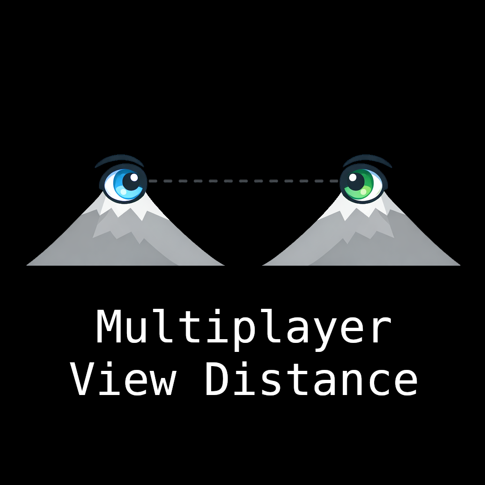

In vanilla Arma 3 (2.20) multiplayer the view distance is locked to 1600m and terrain grid size (terrain quality) is locked to 10. It is not respecting client's nor server's video settings.

This mod is very simple: it makes the multiplayer respect the client's view distance and terrain grid settings, just like in single player. They cannot however be raised over the server's respective settings, this allows the server to control players' maximum view distances.

The mod does only one thing and does it well. It works purely in the background. It does not expose any UI or configurable options. The user won't notice it running in any other way than view distance respecting the user's settings in multiplayer.

## Compatibility

This mod is not compatible with any other mods that adjust view distance. If you have other view distance mods (or scripts in a mission), they will compete over which gets to set the view distance and one of them will win. Most other view distance mods already work in multiplayer so you wouldn't need this one.

This mod only adjusts view distance once when you join a mission or when you or the server adjusts their view distance settings. If you have a dynamic view distance mod (or a script in a mission) that constantly adjusts view distance based on the game situation, the dynamic one will win.

This mod needs communication between the server and client, and must be installed on both to work correctly. If installed only on the server, it only has an effect on the server's own view distance (so on player hosted servers the server player can adjust their view distance). If installed only on the client, it does nothing.

## Links

Steam Workshop:
https://steamcommunity.com/sharedfiles/filedetails/?id=3750588265

## How to build

1. Have [HEMTT](https://github.com/BrettMayson/HEMTT) installed
2. Run `hemtt build` in the project directory
